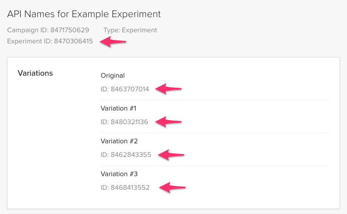

# @s-ui/abtesting-optimizely-x
> A React component that renders one single variation according to OptimizelyX's experiment decision.

```html
<OptimizelyExperiment experimentId={100}>
  <button variationId={1001} defaultVariation>Original</button>
  <button variationId={1002}>Variation #1</button>
  <button variationId={1003}>Variation #2</button>
</OptimizelyExperiment>
```

## Installation

```sh
npm install @s-ui/abtesting-optimizely-x --save
```

## Basic Usage

### 1. Get experiment's id and its variation ids from OptimizelyX

Navigate to: https://app.optimizely.com/v2/ **>** Edit Experiment **>** API Names



### 2. Create your variations and assign its respective ids as below

```javascript
import OptimizelyXExperiment from '@s-ui/abtesting-optimizely-x'
```
```html
<OptimizelyXExperiment experimentId={8470306415}>
  <button variationId={8463707014} defaultVariation>Original</button>
  <button variationId={8480321136}>Variation #1</button>
  <button variationId={8462843355}>Variation #2</button>
  <button variationId={8468413552}>Variation #3</button>
</OptimizelyXExperiment>
```

Component will obtain OptimizelyX's decision for given `experimentId` and display chosen variation.

If no variation is provided or OptimizelyX API is unavailable, `defaultVariation` will be displayed.

## Advanced Usage

### Experiment Context

The following data is set in a plain object to the experiment context.

- All props passed to OptimizelyXExperiment  (see limitations at Known issues section).
- experimentId: The experimentId of the experiment, e.g. `8470306415`.
- isActive: `true` when a decision has been made by optimizely.
- isDefault: `true` when the chosen variation is the default one.
- isVariation: `true` when the chosen variation is *not* the default one.
- isVariationA: `true` when the chosen variation is A.
- isVariationB: `true` when the chosen variation is B.
- ...
- isVariationN: `true` when the chosen variation is N.
- isWrapped: `true` when the current component has OptimizelyXExperiment as a parent (direct or not).
- variationId: The variationId of the chosen variation, e.g. `8463707014`.
- variationName: The variationName of the chosen variation, e.g. `A` (more about this below).

So for a given experiment:

```html
<OptimizelyXExperiment experimentId={8470306415}>
  <NiceComponent variationId={8463707014} defaultVariation />
  <NiceComponent variationId={8480321136} />
</OptimizelyXExperiment>
```

The experiment context can be consumed at any child level by using the `useExperiment` hook:

```js
import {useExperiment} from '@s-ui/abtesting-hooks'

const NiceComponent = () => {
  const {isActive, isDefault, isVariation, ...} = useExperiment()
}
```

### variationName

You may need to check which variation has been chosen down in the children, specially when the experiment has 3 or more possible variations. For the sake of simplicity, OptimizelyXExperiment will automatically assign an uppercase letter for each variation based on the order of children, but you could override it by using `variationName` prop directly into a variation.

```html
<OptimizelyXExperiment experimentId={8470306415}>
  <TestedComponent variationId={8463707014} defaultVariation />
  <TestedComponent variationId={8480321136} />
  <TestedComponent variationId={8462843355} variationName="maneko" />
  <TestedComponent variationId={8468413552} />
</OptimizelyXExperiment>
```

Considering the above example, if we look into TestedComponent we can access the chosen `variationName` from the experiment context through the `useExperiment` hook:

```js
import {useExperiment} from '@s-ui/abtesting-hooks'

const TestedComponent = () => {
  const {variationName} = useExperiment()

  // if 1st variation is chosen: variationName → "A"
  // if 2nd variation is chosen: variationName → "B"
  // if 3rd variation is chosen: variationName → "maneko" (overriden)
  // if 4th variation is chosen: variationName → "D"
  // ...
  // if Nth variation is chosen: variationName → Nth letter in alphabet
  console.log(variationName)
}
```

Also, boolean keys are provided for simplicity:

```js
import {useExperiment} from '@s-ui/abtesting-hooks'

const TestedComponent = () => {
  const {isVariationA, isVariationB, isVariationManeko, isVariationD} = useExperiment()

  // consider 'B' variation is chosen by optimizely, then:
  console.log(isVariationA) // → false
  console.log(isVariationB) // → true
  console.log(isVariationManeko) // → false
  console.log(isVariationD) // → false
}
```

### forceVariation (for development purposes)

While developing in localhost you may need to test different variations:

```html
<OptimizelyXExperiment experimentId={8470306415} forceVariation={8480321136}>
  <button variationId={8463707014} defaultVariation>Cats</button>
  <button variationId={8480321136}>Dogs</button>
</OptimizelyXExperiment>
```

In the above example, "Dogs" variation will be always displayed. You can also use variation name instead:

```html
<OptimizelyXExperiment experimentId={8470306415} forceVariation="B">
  <button variationId={8463707014} defaultVariation>Cats</button>
  <button variationId={8480321136}>Dogs</button>
</OptimizelyXExperiment>
```

NOTE: Since this prop is meant to be used in development environment only, `forceVariation` is just ignored in production as a preventive measure.

### forceActivation (for development purposes)

This prop is similar to `forceVariation` prop, but it simulates an actual activation, so default variation is displayed first and then it gets swapped by the passed variation after X milliseconds (the number of milliseconds can be changed via `forceActivationDelay` prop). This is the closest behaviour to an actual experiment that you could configure in Optimizely's panel because you get the same "flash" effect. This way you can check that nothing gets broken despite the flash, without the need of actually configuring an experiment in Optimizely's panel.

```html
<OptimizelyXExperiment experimentId={8470306415} forceActivation={8480321136}>
  <button variationId={8463707014} defaultVariation>Cats</button>
  <button variationId={8480321136}>Dogs</button>
</OptimizelyXExperiment>
```

In the above example, "Cats" variation will be displayed first, then after a few milliseconds "Dogs" variation will be definitely displayed. You can also use variation name instead:

```html
<OptimizelyXExperiment experimentId={8470306415} forceActivation="B">
  <button variationId={8463707014} defaultVariation>Cats</button>
  <button variationId={8480321136}>Dogs</button>
</OptimizelyXExperiment>
```

NOTE: Since this prop is meant to be used in development environment only, `forceActivation` is just ignored in production as a preventive measure.

## Known issues

### Clipping of variations

[OptimizelyX web API](https://developers.optimizely.com/x/solutions/javascript/introduction/index.html) is used to obtain the decision, not the [fullstack one](https://developers.optimizely.com/x/solutions/sdks/introduction/index.html?language=node). It means that on server side rendering, the default variation will be rendered as Optimizely is not available. Then, when component re-renders on browser, the decided variation will be displayed. So, user may experience some clipping, which could alter test results...

Moreover, depending on how you load Optimizely's snippet, the clipping may also happend in SPA mode (without SSR):
* If you load the snippet as blocking script in `<head>` (recommended by Optimizely itself), no clipping should appear on SPA, as Optimizely will be present on first render.
* If you load Optimizely later (async), the default variation will be rendered on first render. The component will wait for Optimizely until it's loaded (5 seconds max) and then render the decided variation. In that case, user may also experience some clipping.

### Passing props that change over time to the context

All the props passed to OptimizelyXExperiment component will be automatically set on the experiment context. This is why experimentId is available in the context.

```html
<OptimizelyXExperiment experimentId={8470306415} propX="foo" propY="boo">
   <VariationA ...>
   <VariationB ...>
   <VariationC ...>
</OptimizelyXExperiment>
```

In the above example, propX and propY will be available in the context too, but if they change they will not be updated in the context due to technical limitations that would cause unnecessary renders and potentially create other issues.

Extra props can certainly be passed to OptimizelyXExperiment in order to get extra data in the experiment context, but keep in mind that they cannot change.
