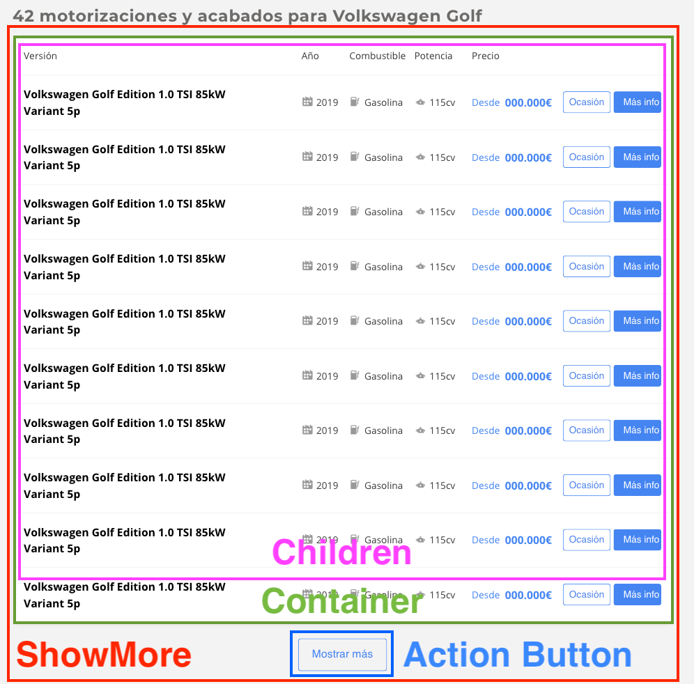
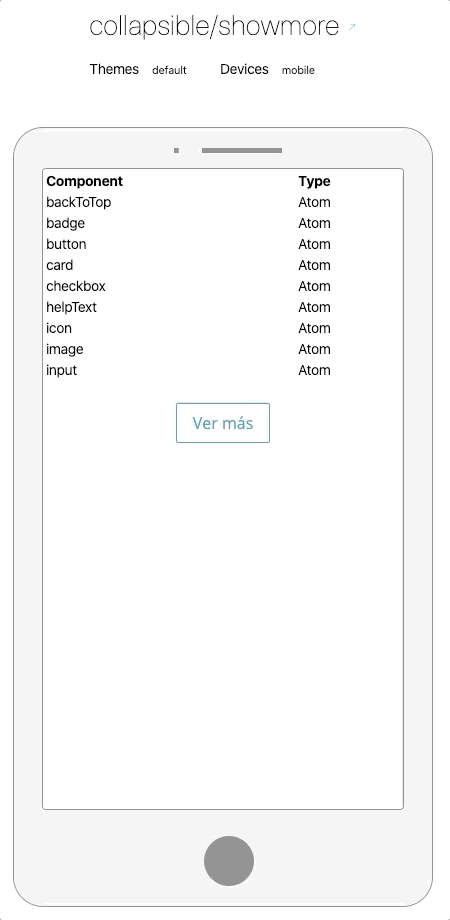

# CollapsibleShowmore

> CollapsideShowmore is a component to show the rest of the results in a list after pressed the **Show more** button and the button will disappear, we don't need a button "Show less" and is not for a pagination use



## Preview



## Installation

```sh
$ npm install @s-ui/react-collapsible-showmore
```

## Usage

### Basic usage

```js
import CollapsibleShowmore from '@s-ui/sui-collapsible-showmore'

const children = <Table />
const copy = 'Show more results'
const maxHeight = 210

return (
  <CollapsibleShowmore children={children} copy={copy} maxHeight={maxHeight} />
)
```

> **Find full description and more examples in the [demo page](#).**
