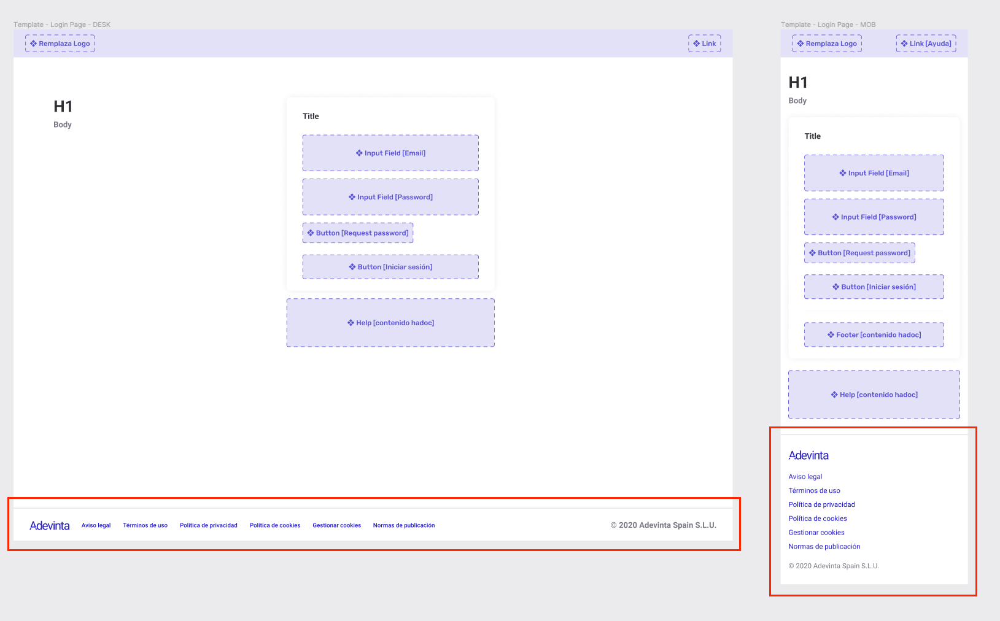

# LoginFooter

Footer for login layout



## Installation

```sh
$ npm install @s-ui/sui-login-footer
```

## Usage

### Basic usage

#### Import package and use the component

```js
import LoginFooter from '@s-ui/sui-login-footer'

return (<LoginFooter companyLogo={logo} links={links} />)
```

#### Import the styles (Sass)

```css
@import '~@s-ui/theme/lib/index';
/* @import 'your theme'; */
@import '~@s-ui/sui-login-footer/lib/index';
```


> **Find full description and more examples in the [demo page](#).**
