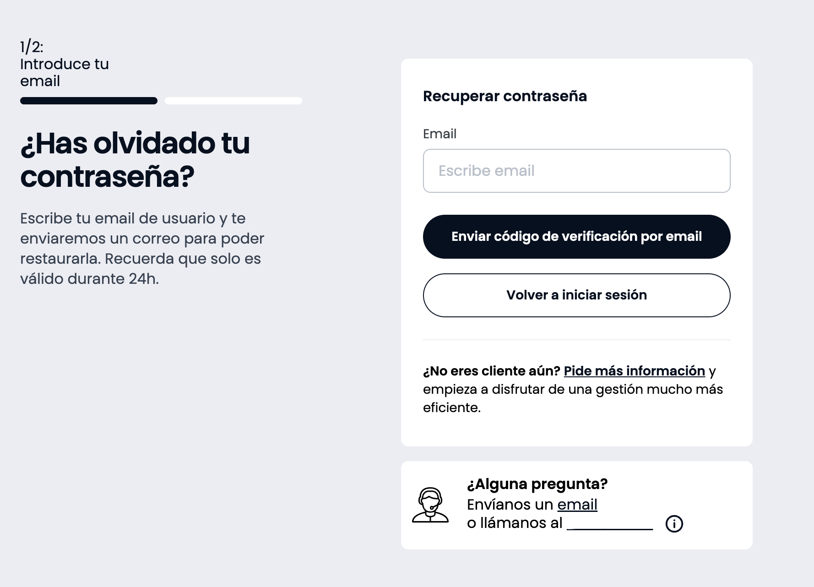

# LoginPasswordReset



## About this component

The purpose of this component is to offer a password recovery interface integrated with the common authentication system of Adevinta.

To achieve so, the component not only renders visual elements, but also encapsulates and offers all the logic related with the password reset process, including error management and execution of use cases in charge of performing requests to the backend endpoints.

## Installation and requirements

This component has been developed and tested under the following environment:

* Node 16
* NPM 8
* React 17

SUI toolkit is required in order to make the component work, as other Adevinta projects do.

Although it may work under other environments, it is not guaranteed and has not been tested.

This component can be installed just by running the following command:

```sh
$ npm install @s-ui/sui-login-password-reset
```

## Basic rendering example

### Import package and use the component

In order to be invoked, the component needs at least to receive the `endpoints` property, which contains the URLs where the endpoints involved in the password recovery process are located.

```js
import LoginPasswordReset from '@s-ui/sui-login-password-reset'

const endpoints = {
  resetPassword: `http://reset-password-endpoint.com/api/v1/reset-password`,
  changePassword: `http://change-password-endpoint.com/api/v1/change-password`
}

return (<LoginPasswordReset endpoints={endpoints} />)
```

### Import the styles (Sass)

To ensure the component is rendered correctly applying the default styles, it is important to require them in the Sass file of the application.

Most of the component styles can be customized by overwriting the default value of some Scss tokens, to know more, please check the section of styles customization.

```css
@import '~@s-ui/theme/lib/index';
/* @import 'your theme'; */
@import '~@s-ui/sui-login-password-reset/lib/index';
```

## Component customization

This component has been designed with customization and extensibility in mind, as it needs to be adaptable to different scenarios and requeriments depending on the project where it is used.

To ensure this extensibility there are available different mechanisms, each of them to cover a specific area or feature of the component.

### I18n

This component uses the `@s-ui/i18n` package to internationalize all texts shown in the interface. Literals are available in `src/literals/es-ES.js`.

Given that it may be necessary to customize these texts, there is available a mechanism to total or partially override them.

As an example, in a hypothetical scenario where the following literals structure is available:

(Only a fragment of the file is shown as an example)

```js
{
  LOGIN_CROSS: {
    PASSWORD_RESET: {
      DOUBTS: {
        TEXT: 'Envíanos un <a href="mailto:xxxxxx">email</a> o llámanos al <a href="tel:xxxxxx">xxxxx</a>.',
        TITLE: '¿Tienes dudas?',
        TOOLTIP:
          'Horario de atención al cliente: <br> De lunes a viernes de 9 a 20 h <br> Sábados de 9 a 14 h'
      }
    }
  }
}
```

In case of needing to override the literals `LOGIN_CROSS.PASSWORD_RESET.DOUBTS.TITLE` and `LOGIN_CROSS.PASSWORD_RESET.DOUBTS.TEXT`, without altering other existing literals, the application should update its own literals file to include the following structure:

```js
{
  LOGIN_CROSS: {
    PASSWORD_RESET: {
      DOUBTS: {
        TEXT: 'Overrided text.',
        TITLE: 'Overrided title'
      }
    }
  }
}
```

And then, it should pass its own instance of `@s-ui/i18n` to the component, through the `i18n` prop.

It is very important to verify that the following points are respected in order to ensure the extensibility works as expected:

1. The component expects to receive the instance of `@s-ui/i18n` within the `i18n`property. Avoid passing an object with the literals structure, as it will not work.

2. Overrided literals must maintain the same structure used by the component. All texts are always contained within the `LOGIN_CROSS` object, to avoid collisions with other already existing literals.

When receiving the `i18n` prop, the component will automatically detect that there are custom values for the literals `LOGIN_CROSS.PASSWORD_RESET.DOUBTS.TITLE` and `LOGIN_CROSS.PASSWORD_RESET.DOUBTS.TEXT`, but it will keep the default value for `LOGIN_CROSS.PASSWORD_RESET.DOUBTS.TOOLTIP`.

As an example, the following code shows how the component can be rendered including the `i18n` prop.

```js
import LoginPasswordReset from '@s-ui/sui-login-password-reset'

const {i18n} = useContext(Context)

return (<LoginPasswordReset i18n={i18n} {...otherProps} />)
```

**Note how the entire i18n instance is passed to the component, instead of just the literals object!**

### Style customization

Most styles can be customized by ovewriting the default value of some Scss tokens. Available tokens can be found in `src/index.scss`, under the ` Overwritable variables` section.

### Icons

There are some icons that can be customized through the `icons` prop, which expects an object containing the following properties:

* `helpContent`.
* `helpContentInfoTooltip`.
* `inputShowPassword`.
* `inputHidePassword`.

Each property can receive both a string containing the URL of an icon, or a React node.

```js
import LoginPasswordReset from '@s-ui/sui-login-password-reset'

const icons = {
  helpContent: 'https://frtassets.fotocasa.es/ut/statics/img/service-desk.svg',
  helpContentInfoTooltip: <InfoOutline />,
  inputShowPassword: <EyeOffOutline size="medium" />,
  inputHidePassword: <EyeOpenOutline size="medium" />
}

return (<LoginPasswordReset icons={icons} {...otherProps} />)
```

### Endpoints

This component performs two http/s requests to complete the password reset process. One to start the process, and send to the user an e-mail to provide the user with a validation link, and another one to complete the process and change the user's password.

These endpoints must maintain a specific contract to be usable by the component. This should not be a problem as long as the component is used along with Adevinta common authentication services.

To specify to the endpoint which URL should be called for each of these two requests, the `endpoints` prop must be used. It expects an object containing the following properties:

* `resetPassword`: URL to be called to start the password reset process.
* `changePassword`: URL to be called to complete the password reset process.

```js
import LoginPasswordReset from '@s-ui/sui-login-password-reset'

const endpoints = {
  resetPassword: `http://reset-password-endpoint.com/api/v1/reset-password`,
  changePassword: `http://change-password-endpoint.com/api/v1/change-password`
}

return (<LoginPasswordReset endpoints={endpoints} {...otherProps} />)
```

Use cases in order to perform requests to these endpoints can be found in the `src/domain/password/UseCases` folder.

### Events

In order to allow the application to execute side-effects when certain interactions and events occur, this component exposes a mechanism to subscribe to these events.

As a large number of events are emitted, this component exposes them through a single prop called `onEvent`. This prop expects to recieve a function that will be called every time an event is emitted.

The `onEvent` function will receive two parameters:

* `event`: A string containing the name of the event that has been emitted.
* `payload`: An object containing the data associated to the event.

This is an example about how rendering the component and subscribing to events through this prop.

```js
import LoginPasswordReset from '@s-ui/sui-login-password-reset'

const onEvent = (event, payload) => {
  console.log(`Event ${event} emitted with payload:`, payload)
}

return (<LoginPasswordReset onEvent={onEvent} {...otherProps} />)
```

The following table shows the list of events that can be subscribed to, and the data associated to each of them.

| Event | Payload | Description |
| --- | --- | --- |
| `RESET_PASSWORD_BUTTON_CLICK` | `{ email }` | Emitted when the user clicks on the submit button from the reset password form. |
| `RESET_PASSWORD_EMAIL_VALIDATION_ERROR` | `{ email, error }` | Emitted when the user tries to submit the form using an invalid or empty email. |
| `RESET_PASSWORD_SUCCESS` | `{ email }` | Emitted when the password reset process has been started successfully after making a request to the reset password endpoint. |
| `RESET_PASSWORD_ERROR` | `{ email, error }` | Emitted when the request to the reset password endpoint fails. |
| `RESET_PASSWORD_RESEND_CLICK` | `{ email }` | Emitted when the user clicks on the "Resend" button from the reset password form. |
| `CHANGE_PASSWORD_BUTTON_CLICK` | `{}` | Emitted when the submit button from the change password form is clicked. |
| `CHANGE_PASSWORD_SUCCESS` | `{}` | Emitted when the password reset process has been totally completed with success, after making a request to the change password endpoint. |
| `CHANGE_PASSWORD_ERROR` | `{ error }` | Emitted when the request to the change password endpoint fails. |

In order to create a new event, it is needed to add it to the `config.js` file, within the `EVENTS` constant, and then use the `useEventBus` hook to emit the event in the desired place.

With demonstration purposes, the following example shows how to emit the `RESET_PASSWORD_BUTTON_CLICK` event, when the user clicks on the submit button from the reset password form.

```js
import useEventBus from '../../hooks/useEventBus.js'

const { emit } = useEventBus()

const handleSubmit = (email) => {
  emit('RESET_PASSWORD_BUTTON_CLICK', { email })
}
```

```

## Other technical comments

### How to start developing and running tests

The following command can be used to start the demo environment, and run available tests:

```sh
$ npm run dev login/passwordReset
```

### Project scaffolding

This component follows the same structure than other Adevinta projects based on the `sui` toolkit. Inside the `src` directory, there is a subfolder for each of the project areas, which are:

* `domain`: Contains the business logic of the component.
* `literals`: Contains the literals used by the component.
* `components`: Contains the subcomponents needed by the main component.
* `hooks`: Contains the custom hooks created to avoid repeating logic.

### Package splitting

Although this component has been developed and published as a single package to make the initial development easier and faster, it may be considered to split it into several packages in the future, as part of development next steps. 

i.e. it could be useful to have a domain package for all cross login use cases on a different repository.